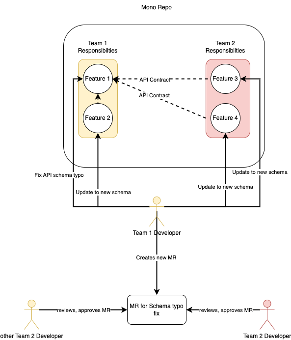

# dispatch

This is a PoC.

With dispatch you can automatically dispatch MR assignments in large mono repositories.

This can be useful when:

- several units/squads/teams work on the same repository
- units/squads/teams have their main code bases, but others will also adjust/enhance the code based on new requirements
- It's a fast pacing environment, but code reviews by the main code owners is critical

Correct MR assignment for the responsible unit/squad/team can be error prone. An automated process can minimize the risk of unwanted code changes and may help for better communication and code quality.

